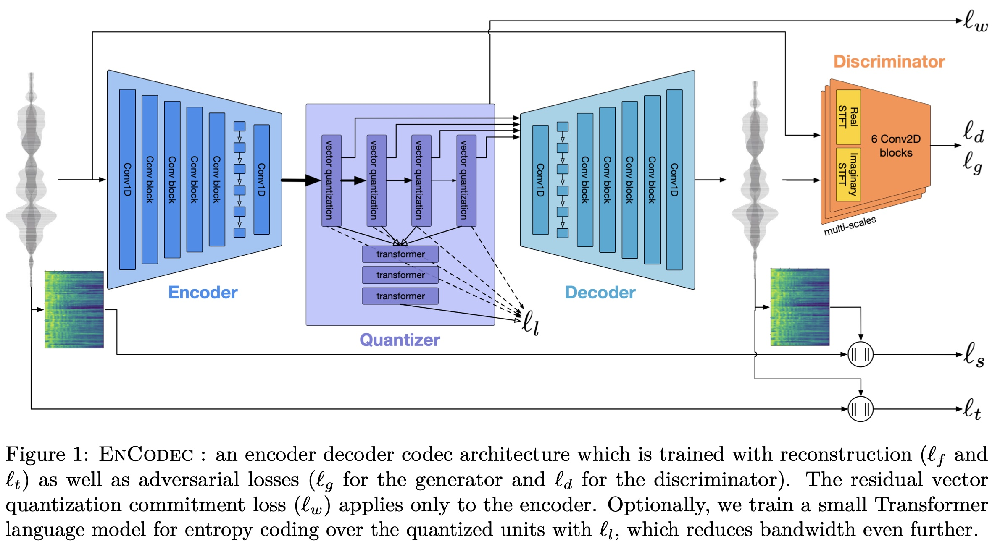
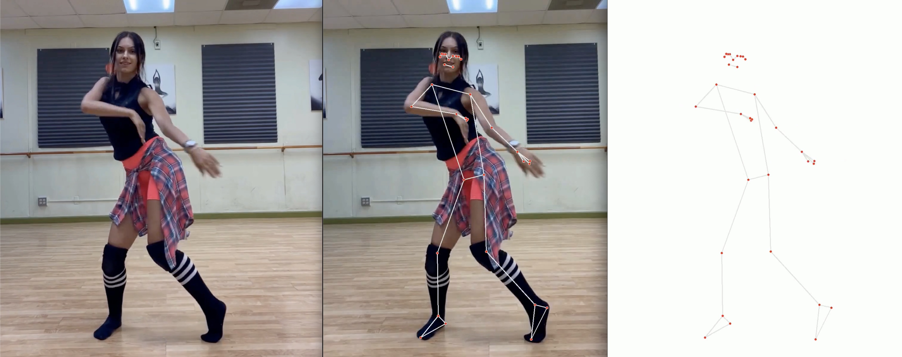

# Dance to Music

## Introduction
Welcome to Dance to Music, an iinovative project that blends computer vison, audio signal processing and generative AI to create novel music based on a sequence of human pose estimates. 

## Table of Contents
- [Introduction](#introduction)
- [Motivation](#motivation)
- [Features](#features)
- [Technologies Used](#technologies-used)
- [Installation](#installation)
- [Usage](#usage)
- [EnCodec Model](#encodec-model)
- [Dataset](#dataset)
- [Model Architecture](#model-architecture)
- [Training](#training)
- [Results](#results)
- [Credits](#credits)
- [License](#license)

## Motivation
Inspried by the recent 'text-to-image' (DALL-E, Midjourney, Stable Diffusion) and 'text-to-music' models (MusicLM, MusicGen), this project aims to develop 'Dance-to-Music'. As input, this model takes in a 5 sec video, and in return produces a 5 second peice of audio that corresponds with the dancer of the video. 

## Features
- Video input analysis for human pose estimation.
- Generation of music through a sequence-to-sequence transformer model.
- Novel audio generation from predicted latent space representations.

## Technologies Used
- [MediaPipe](https://developers.google.com/mediapipe/solutions/vision/pose_landmarker) for 3D human pose estimation
- [Meta's EnCodec model](https://huggingface.co/docs/transformers/main/model_doc/encodec#transformers.EncodecModel) used to create audio encodings from .wav files, as well as a decoder that reconstructs audio from the encoded representation
- Python, PyTorch

## Installation
One can start playing with this project by first cloneing the repository, building the dataset, and then running the training script. 
```bash
# Clone the repository
git clone https://github.com/azeezabdikarim/DanceToMusic.git

# Navigate to the repository
cd DanceToMusic

# Build the Conda environment and download all necessary pages
conda env create -f environment.yml

# Activate the new Conda environemnt 
conda activate dance2music

# Build the video dataset, extracting 5 second clips at 24fps
# FYI: The video downloads might take a while depending on your internet speeds. Also, mediapipe uses the CPU to calculate human pose estimates, so that will take a decent amount of time. It takes me between 1-2 hours to build the complete dataset of ~3200 clips on a Macbook Pro with an M2 Max chip
python data/building_tools/build_complete_dataset.py --output_path data/samples/ --input_csv data/youtube_links/youtube_links_test.csv  --max_seq_len 5 --fps 24

```
## Usage

## EnCodec Model
The EnCodec model is a state-of-the-art high fidelity audio encoder developed by the FAIR team at Meta. The mdoel follows an encoder-decoder type of architecture with the latent space represented by a residual vecotorized quantized latent space. The model is trained with perceptual loss where the generated sampels were judged by a descimantor, to reduce artifacts and generate high quality samples. 

Adding a vector quantized codebook to an autoencoder architecture, such as the Encodec model, enables a discrete representation of the latent space, which can be advantageous for handling complex data distributions and improving the robustness of the model against small input variations. This discretization also facilitates the learning of a more meaningful and structured latent space, which can be beneficial for downstream tasks like generation or retrieval.

When the codebook is extended to a Residual Vector Quantized (RVQ) Codebook, the model gains the ability to capture finer details by representing residuals or differences between the input and the current reconstruction at each stage. This layered approach of quantization allows the model to iteratively refine its output, leading to a more precise and higher fidelity reconstruction than what could be achieved with a standard Vector Quantized Codebook.



## Dataset
The dataset used in this projects is a persoanly aggregated set of dance videos paired with their corresponding music. Each dance clip is processed using MediaPipe's 3D human pose estimation model. Only one human is selected per video clip, for which the model generates a set of 33x3 keypoints per frame. Videos are standardized in the training set to last 5 sec at 24fps, resulting in a sequence of 120 frames per sample. The final dimensions for an idnividual sample are therefore 120x33x3. 



For each dancing clip, I extraxcted the audio as a .wav file. I use the '24khz' encoder of the Encodec audio encoder, to the map the 5 second audio clip to a lower dimensionality latent space. For a 5 second clip, the Ecodec model produces a latent vector of 2x377, which I flattened to 1x754, and use as the target the samples of our dataset. 

## Model Architecture 
From a high-level point of view, the goal of this project is to produce a sequence-to-sequence model capable of mapping a sequence of 33x3 human pose key points to a latent vector, which represents a sequence of codebook values. One of the advantages of using the audio codes generated by the Ecnodec model for our target is the fact that the latent space is represented by a sequence of discrete values from a codebook, meaning the model only needs to learn to predict values of a fixed vocublary. In the case of the '24khz' Enbcodec model, the length of the codebook is 1024. In comparison to the text based tasks where the the vocabularyl can be thosuands of distinct values, 1024 values is a relativly small vocublary, which increases the chances for sucess.

In the context of our training dataset of 5 sec clips filmed at 24fps with an audio sample rate of 24khz, our goals is to map a vector sequence of 120x33x3 to a latent audio code sequence of 1x754. Due to the layered approach of quanitzation in a RVQ codebook, our sequance-to-sequence model most reconstruct the audio codes autoregrssivly. 

## Training

## Results

## Credits

## License
